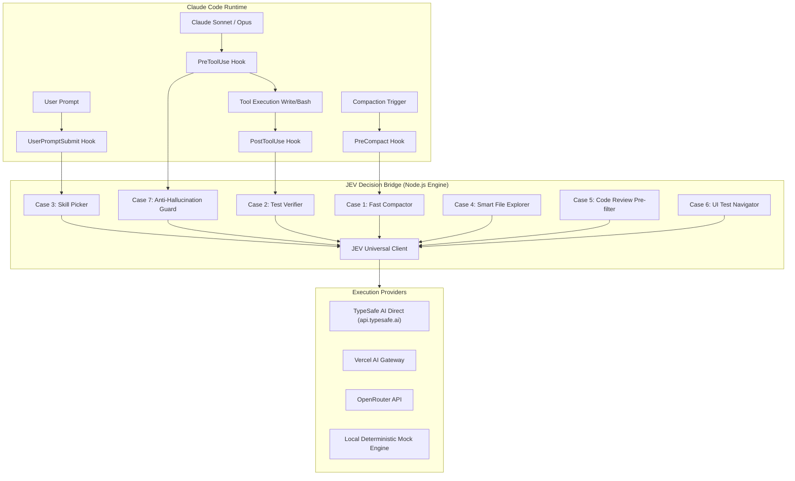

# JEV Decision Engine for Claude Code — Technical Design

## 1. System Architecture

The JEV integration operates as a lightweight, low-latency decision proxy sitting between Claude Code (the primary generative agent) and the execution environment. It uses TypeSafe AI's **JEV System One** model as a deterministic router and guardrail.



---

## 2. JEV System One Protocol & Primitives

JEV is accessed via `POST https://api.typesafe.ai/v1/systemone` (or via Gateway proxy). All questions are evaluated concurrently against the same state context in a single HTTP round-trip (typically 70ms–250ms).

### 2.1 Supported Question Primitives

| Primitive | Type Name | Input Parameters | Output Structure | Usage Case |
| :--- | :--- | :--- | :--- | :--- |
| **Choice** | `"choice"` | `instructions`, `criteria` (map of option -> desc) | `choice` (string), `probabilities`, `confidence` | Skill Picker (Caso 3), Browser UI (Caso 6) |
| **Noul** | `"noul"` | `instructions`, `criteria` (optional) | `noul` (boolean), `probability` (0.0 to 1.0) | Rule Guard (Caso 7), Test Verifier (Caso 2), Compaction (Caso 1), Review Pre-filter (Caso 5) |
| **Score** | `"score"` | `instructions`, `min` (int), `max` (int) | `score` (number), `probabilities`, `confidence` | File Explorer (Caso 4) |

### 2.2 Standard Request Payload Schema

```json
{
  "model": "jev-latest",
  "state": "<string: text context, code diff, prompt, or file list>",
  "questions": {
    "<question_key>": {
      "type": "choice | noul | score",
      "instructions": "<string: precise instruction>",
      "criteria": {
        "<option_key>": "<option_description>"
      }
    }
  }
}
```

### 2.3 Standard Response Schema

```json
{
  "model": "jev-latest",
  "latency_ms": 112,
  "answers": {
    "<question_key>": {
      "type": "choice | noul | score",
      "choice": "<selected_key>",
      "noul": true,
      "score": 8.5,
      "probability": 0.94,
      "confidence": 0.92
    }
  }
}
```

---

## 3. Gateway & Provider Abstraction

To support direct TypeSafe accounts, Vercel AI Gateway, OpenRouter, and offline development, the `JevClient` implements a unified adapter:

```typescript
export interface JevConfig {
  apiKey: string;
  provider: 'typesafe' | 'vercel' | 'openrouter' | 'mock';
  gatewayUrl?: string;
  timeoutMs: number;
}
```

### Provider Matrix

| Provider | Endpoint | Authorization Header | Model Identifier |
| :--- | :--- | :--- | :--- |
| **TypeSafe Direct** | `https://api.typesafe.ai/v1/systemone` | `Bearer $JEV_API_KEY` | `jev-latest` |
| **Vercel AI Gateway** | `$VERCEL_GATEWAY_URL/v1/systemone` | `Bearer $VERCEL_API_KEY` | `typesafe-ai/jev` |
| **OpenRouter** | `https://openrouter.ai/api/v1/chat/completions` (or systemone adapter) | `Bearer $OPENROUTER_API_KEY` | `typesafe/jev-latest` |
| **Mock Engine** | In-memory evaluation | None | `jev-mock` |

---

## 4. Claude Code Hook & Skill Implementations

### 4.1 Caso 3: The Skill Picker (`UserPromptSubmit` Hook)
- **Path:** `~/.claude/hooks/jev-skill-picker.js`
- **Trigger:** Executes before Claude sees the user prompt.
- **Workflow:**
  1. Reads prompt from `stdin`.
  2. Scans `~/.claude/skills/` and project `.claude/skills/` extracting name + description from `SKILL.md` frontmatter.
  3. Sends prompt + candidate skills to JEV `choice` question.
  4. If JEV selects a skill with `confidence >= 0.70`, appends system hint:
     `[JEV ROUTER]: Invoke skill '${selectedSkill}' for this request. Do NOT load other skill definitions.`
  5. Returns in <200ms. Claude saves ~15,000–30,000 context tokens by not reading 96 skill specs.

### 4.2 Caso 7: Bloqueador Anti-Alucinação (`PreToolUse` Hook)
- **Path:** `~/.claude/hooks/jev-rule-guard.js`
- **Matcher:** `FileEdit|FileWrite|Write|Edit`
- **Workflow:**
  1. Intercepts proposed file path and new file content/diff.
  2. Reads project rules from `CLAUDE.md`, `.cursorrules`, or local architectural rules.
  3. Sends rules + diff to JEV:
     ```json
     {
       "questions": {
         "violates_rules": {
           "type": "noul",
           "instructions": "Does this code change violate any project rule, architectural boundary, or prohibited practice?"
         },
         "rule_id": {
           "type": "choice",
           "instructions": "Which rule is violated?",
           "criteria": { "r1": "no direct DB query in controller", "r2": "use RTK proxy", "r3": "typed errors" }
         }
       }
     }
     ```
  4. If `violates_rules.noul === true` and `violates_rules.probability >= 0.80`:
     - Exits with **status code 2** (Claude Code blocking protocol).
     - Prints: `[JEV GUARD REJECTED]: Edit blocked! Violates rule: ${rule_id}. Fix code before proceeding.`
  5. If safe, exits with code 0.

### 4.3 Caso 1: Fast Jev Compaction (`PreCompact` Hook)
- **Path:** `~/.claude/hooks/jev-fast-compact.js`
- **Workflow:**
  1. Checks session token usage. If context utilization < 25%, exits 0 (lets standard summarizer run).
  2. If > 25%, chunks conversation history into message turns.
  3. JEV evaluates each turn (`noul`: Keep/Discard).
  4. Generates an instant, highly compact memory card (active goals, files modified, pending blockers).
  5. Reduces compaction pause from ~15s to ~1.5s.

### 4.4 Caso 2: Verificador de Cobertura de Testes (`PostToolUse` Hook)
- **Path:** `~/.claude/hooks/jev-test-coverage.js`
- **Matcher:** `FileEdit|FileWrite|Write|Edit`
- **Workflow:**
  1. Checks if edited file is in a control domain (`/auth/`, `/permissions/`, `/services/`, `/guards/`).
  2. Finds corresponding test files.
  3. Asks JEV `noul`: "Is this newly added/modified business rule verified by a test case in test files?".
  4. If NO, outputs a visible reminder: `⚠️ [JEV TEST GUARD]: Alteração na regra de controle sem teste correspondente detectada! Recomendado gerar teste.`

### 4.5 Caso 4: Smart File Explorer (`jev-explore` Skill)
- **Path:** `~/.claude/skills/jev-explore/`
- **Workflow:**
  1. Fast `rg --files` or keyword match finds 50 candidates.
  2. Splits into batches of 20.
  3. Asks JEV `score` (1-10) for each file given the user query.
  4. Returns top 3 sorted files directly to Claude.

### 4.6 Caso 5: Pré-Filtro de Code Review (`jev-review` Skill)
- **Path:** `~/.claude/skills/jev-review/`
- **Workflow:**
  1. Extracts `git diff --cached` (or working directory diff).
  2. Runs 7 `noul` parallel questions in JEV (clean arch, security, breaking API, DB migrations, secrets, complexity, missing tests).
  3. If all 7 are NO: prints `✅ FAST PASS: Mudança de baixo risco aprovada em 180ms (0 tokens LLM gastos).`
  4. If any YES: outputs targeted flags and instructs Claude to run full deep review only on those specific risks.

### 4.7 Caso 6: Browser UI Testing Autônomo (`jev-browser-test` Skill)
- **Path:** `~/.claude/skills/jev-browser-test/`
- **Workflow:**
  1. Extracts clickable DOM elements (`data-testid`, buttons, links) into a candidate map.
  2. JEV evaluates `choice` against the user goal.
  3. Executes click/fill via Playwright/DevTools.
  4. Repeats loop until destination page reached. Claude performs final semantic verification.

---

## 5. Token & Speed Benchmark Telemetry

To satisfy the user's requirement to *"ver se realmente tem um ganho interessante de velocidade e custo de token"*, every call records telemetry to `.jev/telemetry.jsonl`:

```json
{
  "timestamp": "2026-09-29T22:45:00Z",
  "feature": "skill-picker",
  "jev_latency_ms": 138,
  "jev_cost_usd": 0.000012,
  "estimated_llm_latency_ms": 3200,
  "estimated_llm_tokens_saved": 18500,
  "estimated_llm_cost_saved_usd": 0.0555
}
```

A companion CLI command `jev gain` (analogous to `rtk gain`) displays a summary report:
```
==================================================
  JEV Decision Engine — Performance & Token Savings
==================================================
Total Decisions Routed:      142
Average JEV Latency:         124 ms  (vs ~2,800 ms LLM)
Tokens Saved from Context:   1,420,000 tokens
Estimated Cost Saved:        $4.26 USD
Decision Accuracy / Hits:    96.4%
==================================================
```

---

## 6. Fail-Open & Reliability Policy

```
┌───────────────────────────────────────────────┐
│               Claude Code Hook                │
└──────────────────────┬────────────────────────┘
                       │
             Call JEV Bridge with Timeout (1500ms)
                       │
         ┌─────────────┴─────────────┐
      Success                     Error / Timeout / No Key
         │                                   │
 Process Decision                  Fail-Open (Exit 0)
 (Exit 0 or Exit 2)                Standard Claude Code continues
```

- If `JEV_API_KEY` is not configured, hooks log a quiet warning and immediately exit 0.
- If network connection fails or hangs >1500ms, abort signal triggers and hook exits 0.
- Claude Code is never broken or stalled by external API downtime.
