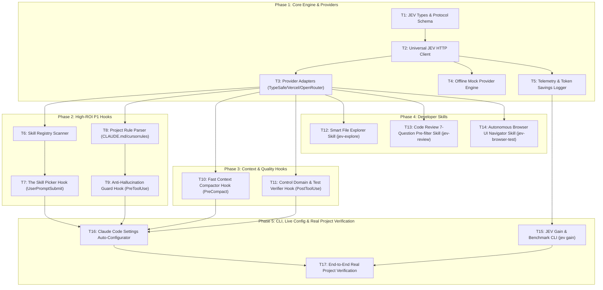

# JEV Decision Engine for Claude Code — Implementation Tasks

## Execution Plan & Dependency Graph

---

## Phase 1: Core Engine & Providers (Foundational)

### T1: JEV Types & Protocol Schema [P]
- **Deliverable:** `src/types.ts`
- **Depends on:** None
- **Tests:** `tests/types.test.ts`
- **Gate:** TypeScript compiles cleanly (`tsc --noEmit`), unit test validates schema definition.
- **Done When:** All interfaces for `ChoiceQuestion`, `NoulQuestion`, `ScoreQuestion`, request payloads, and response envelopes are strictly typed.

### T2: Universal JEV HTTP Client
- **Deliverable:** `src/client.ts`
- **Depends on:** T1
- **Tests:** `tests/client.test.ts`
- **Gate:** Vitest/Jest unit tests pass with mock HTTP server.
- **Done When:** `JevClient.evaluate(state, questions)` sends valid JSON payload, handles 1500ms timeout with abort controller, and parses typed responses.

### T3: Provider Adapters (TypeSafe, Vercel AI Gateway, OpenRouter)
- **Deliverable:** `src/providers.ts`
- **Depends on:** T2
- **Tests:** `tests/providers.test.ts`
- **Gate:** Unit tests pass asserting correct headers, URLs, and auth mapping for each provider.
- **Done When:** Adapter switches dynamically between `typesafe` (`api.typesafe.ai`), `vercel` (`gateway.ai.cloudflare.com/v1` or Vercel Gateway), and `openrouter`.

### T4: Offline Mock Provider Engine [P]
- **Deliverable:** `src/mock-provider.ts`
- **Depends on:** T2
- **Tests:** `tests/mock-provider.test.ts`
- **Gate:** Unit tests verify deterministic answers generated in <5ms without network connection.
- **Done When:** Allows developers to test all hooks and skills locally with realistic probabilities without consuming live API tokens.

### T5: Telemetry & Token Savings Logger [P]
- **Deliverable:** `src/telemetry.ts`
- **Depends on:** T2
- **Tests:** `tests/telemetry.test.ts`
- **Gate:** Unit tests assert entries are appended atomically to `.jev/telemetry.jsonl` with latency and token metrics.
- **Done When:** Every JEV decision automatically logs execution latency, tokens spared, and estimated USD cost savings.

---

## Phase 2: High-ROI P1 Hooks

### T6: Skill Registry Scanner
- **Deliverable:** `src/skills-scanner.ts`
- **Depends on:** T3
- **Tests:** `tests/skills-scanner.test.ts`
- **Gate:** Unit test discovers skills in `~/.claude/skills` and local `.claude/skills`, extracts frontmatter title/description.
- **Done When:** Returns a clean array of `{ id, name, description }` under 20ms without reading full file bodies.

### T7: The Skill Picker Hook (UserPromptSubmit)
- **Deliverable:** `hooks/jev-skill-picker.js`
- **Depends on:** T6
- **Tests:** `tests/skill-picker.test.ts`
- **Gate:** Automated hook test passes: when prompt matches an installed skill, outputs routing directive; passes through cleanly when no skill matches.
- **Done When:** Hook reads `stdin`, invokes JEV `choice` question, and outputs modified prompt context in <250ms.

### T8: Project Rule Parser
- **Deliverable:** `src/rule-parser.ts`
- **Depends on:** T3
- **Tests:** `tests/rule-parser.test.ts`
- **Gate:** Unit test verifies extraction of rule list from `CLAUDE.md`, `.cursorrules`, and architectural rule files.
- **Done When:** Produces a normalized map of rule IDs and criteria descriptions for JEV consumption.

### T9: Anti-Hallucination Guard Hook (PreToolUse)
- **Deliverable:** `hooks/jev-rule-guard.js`
- **Depends on:** T8
- **Tests:** `tests/rule-guard.test.ts`
- **Gate:** Unit test asserts exit code `2` on rule-breaking diffs and exit code `0` on compliant edits.
- **Done When:** Hook intercepts `FileEdit`/`Write` payloads, evaluates against project rules with JEV `noul`, and blocks edits having violation probability ≥ 0.80.

---

## Phase 3: Context & Quality Hooks

### T10: Fast Context Compactor Hook (PreCompact)
- **Deliverable:** `hooks/jev-fast-compact.js`
- **Depends on:** T3
- **Tests:** `tests/fast-compact.test.ts`
- **Gate:** Unit test passes: skips JEV if context <25%; generates pruned context summary when >25%.
- **Done When:** Extracts conversation history turns, prunes discardable turns via JEV `noul`, and writes accelerated summary card.

### T11: Control Domain & Test Verifier Hook (PostToolUse)
- **Deliverable:** `hooks/jev-test-verifier.js`
- **Depends on:** T3
- **Tests:** `tests/test-verifier.test.ts`
- **Gate:** Unit test verifies detection of modified auth/permission files and generation of missing-test alerts.
- **Done When:** Intercepts post-edit events, cross-references modified rules against test suites, and flags uncovered criteria.

---

## Phase 4: Developer Skills

### T12: Smart File Explorer Skill (jev-explore)
- **Deliverable:** `skills/jev-explore/SKILL.md` and `skills/jev-explore/explore.js`
- **Depends on:** T3
- **Tests:** `tests/explore.test.ts`
- **Gate:** Test verifies 50 files chunked into batches of 20, scored by JEV, and only top 3 files returned.
- **Done When:** Skill command `/jev-explore <query>` runs in <800ms and ranks files with JEV `score`.

### T13: Code Review 7-Question Pre-filter Skill (jev-review)
- **Deliverable:** `skills/jev-review/SKILL.md` and `skills/jev-review/review.js`
- **Depends on:** T3
- **Tests:** `tests/review.test.ts`
- **Gate:** Test asserts FAST PASS on benign edits and ESCALATION to deep review on breaking/security diffs.
- **Done When:** Evaluates git diff against the 7 defined questions and outputs instant verdict or targeted LLM review instructions.

### T14: Autonomous Browser UI Navigator Skill (jev-browser-test)
- **Deliverable:** `skills/jev-browser-test/SKILL.md` and `skills/jev-browser-test/navigator.js`
- **Depends on:** T3
- **Tests:** `tests/browser-test.test.ts`
- **Gate:** Mock DOM test verifies JEV selects sequential buttons to complete multi-step navigation.
- **Done When:** Extracts interactive DOM elements, uses JEV `choice` to step through UI, and hands off to Claude for final assertion.

---

## Phase 5: CLI, Live Config & Real Project Verification

### T15: JEV Gain & Benchmark CLI (jev gain)
- **Deliverable:** `bin/jev.js`
- **Depends on:** T5
- **Tests:** `tests/cli.test.ts`
- **Gate:** Running `jev gain` reads `.jev/telemetry.jsonl` and formats ASCII analytics table.
- **Done When:** Developer can run `jev gain` or `jev gain --history` to see exact token savings and latency improvements.

### T16: Claude Code Settings Auto-Configurator
- **Deliverable:** `scripts/install-hooks.js`
- **Depends on:** T7, T9, T10, T11
- **Tests:** `tests/installer.test.ts`
- **Gate:** Safely merges hooks into `~/.claude/settings.json` or project `.claude/settings.json` without destroying existing hooks (RTK, BoltContext, TTS).
- **Done When:** Injects `PreToolUse`, `PostToolUse`, `UserPromptSubmit`, and `PreCompact` with proper matchers and backup file creation.

### T17: End-to-End Real Project Verification
- **Deliverable:** Verification Report in `.specs/jev-claude-engine/validation.md`
- **Depends on:** T15, T16
- **Tests:** End-to-end dry run in real project workspace.
- **Gate:** All 7 use cases verified, `jev gain` displays real savings metrics, zero crashes or blocked sessions.
- **Done When:** Complete validation report produced with latency and token savings evidence.

---

## Pre-Approval Validation Gates

### Check 1: Task Granularity
| Task | Deliverable | Single Responsibility Verified |
| :--- | :--- | :--- |
| T1 | `src/types.ts` | ✅ Only schema & type definitions |
| T2 | `src/client.ts` | ✅ Only HTTP request/timeout protocol |
| T3 | `src/providers.ts` | ✅ Only provider endpoint/header mapping |
| T4 | `src/mock-provider.ts` | ✅ Only offline mock evaluation |
| T5 | `src/telemetry.ts` | ✅ Only token & latency logging |
| T6 | `src/skills-scanner.ts` | ✅ Only skill metadata extraction |
| T7 | `hooks/jev-skill-picker.js` | ✅ Only prompt routing hook |
| T8 | `src/rule-parser.ts` | ✅ Only project rule parsing |
| T9 | `hooks/jev-rule-guard.js` | ✅ Only edit blocking hook |
| T10 | `hooks/jev-fast-compact.js` | ✅ Only context compaction filtering |
| T11 | `hooks/jev-test-verifier.js` | ✅ Only control domain test coverage verification |
| T12 | `skills/jev-explore/*` | ✅ Only smart file scoring skill |
| T13 | `skills/jev-review/*` | ✅ Only 7-question code review pre-filter |
| T14 | `skills/jev-browser-test/*` | ✅ Only UI step navigation skill |
| T15 | `bin/jev.js` | ✅ Only CLI analytics viewer |
| T16 | `scripts/install-hooks.js` | ✅ Only safe hook configuration |
| T17 | `validation.md` | ✅ Only end-to-end evidence collection |

### Check 2: Diagram-Definition Cross-Check
| Task | Depends On Field | Diagram Matches? |
| :--- | :--- | :--- |
| T1 | None | ✅ Root |
| T2 | T1 | ✅ Matched |
| T3 | T2 | ✅ Matched |
| T4 | T2 | ✅ Matched |
| T5 | T2 | ✅ Matched |
| T6 | T3 | ✅ Matched |
| T7 | T6 | ✅ Matched |
| T8 | T3 | ✅ Matched |
| T9 | T8 | ✅ Matched |
| T10 | T3 | ✅ Matched |
| T11 | T3 | ✅ Matched |
| T12 | T3 | ✅ Matched |
| T13 | T3 | ✅ Matched |
| T14 | T3 | ✅ Matched |
| T15 | T5 | ✅ Matched |
| T16 | T7, T9, T10, T11 | ✅ Matched |
| T17 | T15, T16 | ✅ Matched |
