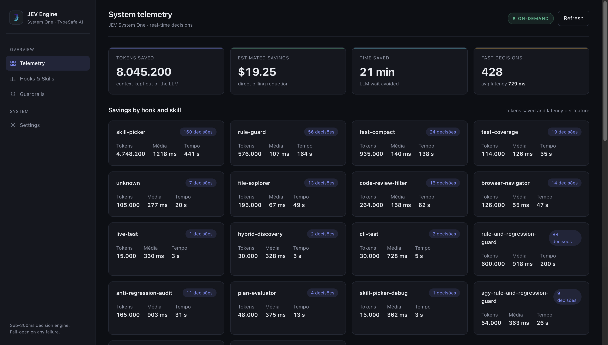

# JEV Claude Engine

**Sub-300ms decision engine for Claude Code, Codex, OpenCode, and AGY — powered by TypeSafe AI's System One.**

JEV (Judgment Evaluation Vehicle) delegates the small, repetitive micro-decisions that coding agents make thousands of times a day to a deterministic, schema-enforced decision model instead of a generative LLM. This cuts decision latency from ~3,200 ms to under 300 ms, eliminates token bloat from dumping dozens of skill definitions into context, and prevents hallucinated or regression-prone edits before they touch disk.

---

## Table of Contents

- [Why JEV](#why-jev)
- [How it works](#how-it-works)
- [Features](#features)
  - [Hooks (automated guardrails)](#hooks-automated-guardrails)
  - [Skills (on-demand decision tools)](#skills-on-demand-decision-tools)
  - [CLI & Dashboard](#cli--dashboard)
- [Installation](#installation)
- [Configuration](#configuration)
- [Usage](#usage)
- [Agent compatibility](#agent-compatibility)
- [Architecture](#architecture)
- [Testing](#testing)
- [Telemetry & ROI](#telemetry--roi)
- [License](#license)

---

## Why JEV

Frontier LLMs (Claude, GPT, etc.) are exceptional at generative work, but they are slow and expensive at structured micro-decisions. In a typical agent session, decisions like "which of my 90+ skills matches this prompt?", "does this diff violate project rules?", or "is this context worth keeping during compaction?" are made by generating free-form prose, token by token.

That creates three problems:

| Problem | Generative LLM | JEV System One |
| :--- | :--- | :--- |
| **Latency** | 2,000–10,000 ms per decision | **~100–300 ms** |
| **Context bloat** | Skill schemas + tool descriptions dumped into every prompt | Only the winning skill is loaded |
| **Reliability** | Free-form prose, malformed JSON, retry loops | **Schema-enforced** `choice`, `noul`, and `score` primitives |

JEV runs at **$0.04/M input tokens with zero output-token charge**, and every hook is **fail-open**: if JEV times out (>1,500 ms) or errors, the hook exits with code `0` and normal agent behavior continues — your session never breaks because of a network blip.

---

## How it works

```
 User prompt / diff / context
        │
        ▼
 ┌─────────────┐   deterministic question schema   ┌──────────────────┐
 │  Agent hook │ ───────────────────────────────►  │  JEV System One  │
 │ (Claude/CC) │                                   │  (TypeSafe AI)   │
 └─────────────┘ ◄───────────────────────────────  │  ~100-300 ms     │
        │         choice | noul | score answers    └──────────────────┘
        ▼
   Decision applied (route, block, pass, score)
        │
        ▼
   Telemetry → .jev/telemetry.jsonl (tokens saved, latency, cost)
```

The core `JevClient` supports **multiple providers** (TypeSafe direct, Vercel AI Gateway, OpenRouter) with automatic key resolution from environment variables or `~/.claude/settings.json`, plus an offline **Mock Mode** (`JEV_MOCK_MODE=1`) for development and testing without network egress.

---

## Features

### Hooks (automated guardrails)

Hooks run automatically at specific points in the agent lifecycle. They require no manual invocation and add zero overhead to normal prompts (they exit immediately when not applicable).

#### `jev-rule-guard.js` — Anti-Hallucination / Rule Enforcement Guard

**Trigger:** `PreToolUse` on `Write`/`Edit`.

**What it adds:** Intercepts every file modification before it reaches disk and asks JEV three binary (`noul`) questions:
1. Does the proposed code violate a project rule (from `CLAUDE.md`, `.cursorrules`, etc.)?
2. Does it break, rename, or remove an existing public function/contract used elsewhere?
3. Does it delete, disable, or weaken previously working business logic or tests?

If a violation is detected with confidence ≥ 80–85%, the hook prints a formatted diff card to stderr and **exits with code `2`**, deterministically blocking the edit and forcing a fix. Compliant edits pass through untouched.

**Value:** Stops hallucinated imports, layer violations, broken contracts, and silent regressions at the moment they're attempted — before they enter git history.

#### `jev-fast-compact.js` — Fast Context Compaction

**Trigger:** `PreCompact`.

**What it adds:** When context utilization exceeds 25%, JEV classifies conversation history with a `noul` Keep/Discard decision so only critical decisions, active tasks, and code diffs are retained. Below 25% it exits immediately and lets the standard summarizer run.

**Value:** Cuts compaction latency by >60% and preserves architectural decisions that a naive summarizer would flatten into prose.

#### `jev-test-verifier.js` — Test Coverage Verifier

**Trigger:** `PostToolUse` on `Write`/`Edit`.

**What it adds:** Watches files matching control-domain patterns (`auth`, `role`, `permission`, `policy`, `guard`, `payment`, `billing`, `session`…). After a control file is edited, JEV checks whether the modified business rules have corresponding automated tests and prints a structured warning when coverage is missing.

**Value:** Enforces test discipline on security- and money-critical paths without spending a single generative token or blocking the workflow.

#### `jev-skill-picker.js` — Skill Router

**Trigger:** `UserPromptSubmit`.

**What it adds:** Scans installed skills (from `~/.claude/skills` and project-local `.claude/skills`), and when more than 5 are present, asks JEV a `choice` question: *"which single skill best matches this prompt?"* On a confident match (≥50%), it injects a routing directive into the prompt so the agent loads exactly one skill — instead of every skill definition.

**Value:** The single highest token-saving lever. With 90+ skills installed, each prompt avoids hundreds of thousands of tokens of skill metadata.

### Skills (on-demand decision tools)

Skills are invoked explicitly (as slash commands or via CLI) and give the agent a fast, deterministic answer before it does expensive generative work.

#### `/jev-discover` — Hybrid Discovery Pipeline

**What it adds:** A 4-stage pipeline before Claude reads any code:
1. **Graphify** — knowledge-graph communities & structural relations
2. **GrepAI** — semantic vector search + symbol/call tracing
3. **JEV System One** — scores all candidates (1–10) in <200 ms
4. **Claude** — reads only the top 2–3 winning files

**Value:** Turns "which files are relevant to this question?" from a 30-file sequential read into a scored, ranked shortlist. Massive context savings on codebase questions.

#### `/jev-explore` — Smart File Explorer

**What it adds:** Collects candidate files (up to 40), scores them in batches of 20 via JEV `score` questions, and returns only the top 3 most relevant files.

**Value:** Prevents context waste from opening dozens of files to answer "where is X implemented?".

#### `/jev-review` — 7-Question Code Review Pre-filter

**What it adds:** Runs the current `git diff` against 7 binary `noul` questions:
1. Architecture violation?
2. Critical security/auth change?
3. Breaking public API contract?
4. DB migration / data-loss risk?
5. Secret or credential exposure?
6. Excessively high complexity?
7. Missing test coverage?

If all answers are **no**, it issues a fast **PASS** in ~200 ms with **zero LLM tokens**. If any answer is **yes**, it escalates to the full generative review with targeted attention points.

**Value:** Trivial commits no longer trigger expensive Opus/Sonnet reviews; only risky diffs do.

#### `/jev-plan-evaluator` — Bugfix Plan & Hypothesis Evaluator

**What it adds:** Before you write a single line of code, JEV evaluates your proposed plan against the reported problem using three primitives:
- `choice` — optimal / symptom-patch / high-regression-risk / ineffective
- `noul` — does it address the root cause?
- `score` — technical solidity 1–5

**Value:** Exposes the AI's optimism bias. A plan that only masks a symptom ("disable the button in the frontend") is flagged before implementation, preventing wasted effort and production regressions.

#### `/jev-anti-regression` — Anti-Regression Sentinel

**What it adds:** Analyzes the current diff for functional regressions:
- Broken/removed public signatures or contracts
- Deleted or weakened existing business logic
- Tests commented out or weakened to force the pipeline green
- Hidden side effects on shared state/schemas

**Value:** A second set of deterministic eyes on code that "was already working", before it lands in a commit.

#### `/jev-browser-test` + Browser Harness acceleration

**What it adds:** Lets JEV drive autonomous browser navigation. Instead of dumping the full accessibility tree (15k–40k tokens) and waiting 5–10 s per step for an LLM, the harness extracts visible interactive elements and JEV picks the next click/action in **~180–250 ms** via the `choice` primitive. Includes:

- `jev_click_goal("...")` — autonomous loop toward a goal
- `jev_decide_click(...)` — granular single-step decision
- `jev_verify_page(...)` — ultra-fast semantic verification (`noul`)
- `pilot.py` — CLI pilot with a **with-JEV vs without-JEV benchmark** (`--benchmark-youtube`)

**Value:** Cuts browser test cycles from ~40 s to ~4 s and saves ~95% of LLM tokens per navigation step.

### CLI & Dashboard

#### `jev` CLI

```bash
jev gain              # ROI telemetry: decisions, latency, tokens & dollars saved
jev gain --history    # last 10 decisions
jev dashboard         # on-demand web dashboard at http://localhost:3838
jev browser "<goal>"  # autonomous JEV browser navigation
jev test              # verify TypeSafe JEV API connection
```

#### `jev dashboard` — On-Demand Telemetry Dashboard

A zero-dependency Node.js HTTP server that renders live telemetry (decisions, token savings, latency, cost) as a dark-themed dashboard. It starts **only when you ask**, exits cleanly with `Ctrl+C`, and releases 100% of memory and ports — zero background footprint.

---

## Installation

Requires **Node.js ≥ 18** and `browser-harness` (for the browser feature).

```bash
# 1. Clone
git clone https://github.com/<you>/jev-claude-engine.git
cd jev-claude-engine

# 2. Install hooks + env keys into ~/.claude/settings.json
node scripts/install-hooks.js

# 3. (Optional) Symlink the skills so any agent can load them
ln -s "$PWD/skills/jev-discover"         ~/.claude/skills/jev-discover
ln -s "$PWD/skills/jev-explore"          ~/.claude/skills/jev-explore
ln -s "$PWD/skills/jev-review"           ~/.claude/skills/jev-review
ln -s "$PWD/skills/jev-plan-evaluator"   ~/.claude/skills/jev-plan-evaluator
ln -s "$PWD/skills/jev-anti-regression"  ~/.claude/skills/jev-anti-regression
ln -s "$PWD/skills/jev-browser-test"     ~/.claude/skills/jev-browser-test

# 4. (Optional) Global CLI
npm link
```

---

## Configuration

JEV resolves its provider automatically by precedence:

| Priority | Source | Endpoint |
| :--- | :--- | :--- |
| 1 | `JEV_MOCK_MODE=1` | Offline deterministic mock |
| 2 | `JEV_PROVIDER=openrouter` | `https://openrouter.ai/api/v1/systemone` |
| 3 | `JEV_GATEWAY_URL` | Vercel AI Gateway / custom |
| 4 | `JEV_API_KEY` / `TYPESAFE_API_KEY` | `https://api.typesafe.ai/v1/systemone` |
| 5 | `~/.claude/settings.json` `env` | TypeSafe |
| 6 | `OPENROUTER_API_KEY` | OpenRouter |

```bash
# Minimal setup — a single key is enough
export JEV_API_KEY="apikey_xxx"

# Mock mode for offline development
export JEV_MOCK_MODE=1

# Optional: custom gateway
export JEV_GATEWAY_URL="https://your-gateway/v1/systemone"
```

Timeout is **1,500 ms** (2,500 ms for TypeSafe direct). On timeout or error, hooks fail open (`exit 0`).

---

## Usage

| Task | Command |
| :--- | :--- |
| Route prompt to the right skill | (automatic via `UserPromptSubmit` hook) |
| Block rule-breaking edits | (automatic via `PreToolUse` hook) |
| Find relevant files fast | `/jev-discover <question>` or `/jev-explore <term>` |
| Pre-review a diff in 200 ms | `/jev-review` |
| Validate a bugfix plan | `/jev-plan-evaluator "<problem>" "<plan>"` |
| Guard against regressions | `/jev-anti-regression` |
| Autonomous browser test | `jev browser "navigate to billing and download invoice"` |
| See ROI | `jev gain` / `jev dashboard` |

---

## Agent compatibility

| Agent | Hooks | Skills |
| :--- | :--- | :--- |
| **Claude Code** | ✅ `settings.json` | ✅ `~/.claude/skills/` |
| **OpenCode** | ✅ (plugin/symlink) | ✅ `~/.opencode/skills/` |
| **Codex CLI** | ✅ | ✅ `~/.codex/skills/` |
| **AGY** | ✅ | ✅ |

All hooks follow the same fail-open discipline, so they behave identically (and safely) across agents.

---

## Architecture

```
src/
  client.js           JevClient — request lifecycle, timeout, fail-open
  providers.js        Multi-provider resolution (TypeSafe/VerCel/OpenRouter/Mock)
  types.js            choice | noul | score primitives + payload validation
  telemetry.js        JSONL telemetry recorder (project + ~/.jev mirror)
  skills-scanner.js   SKILL.md frontmatter scanner with 60s cache
  rule-parser.js      Project rule extraction (CLAUDE.md, .cursorrules)
  ui.js               ANSI decision cards & diff highlight renderer
  dashboard.js        Zero-dependency on-demand web dashboard
  mock-provider.js    Deterministic offline decision engine
hooks/
  jev-rule-guard.js      PreToolUse  — anti-hallucination guard
  jev-fast-compact.js    PreCompact  — keep/discard classification
  jev-test-verifier.js   PostToolUse — test coverage verifier
  jev-skill-picker.js    UserPromptSubmit — skill router
skills/
  jev-discover/          Graphify ➔ GrepAI ➔ JEV ➔ Claude pipeline
  jev-explore/           Batch file scoring
  jev-review/            7-question review pre-filter
  jev-plan-evaluator/    Root-cause plan validator
  jev-anti-regression/   Regression sentinel
  jev-browser-test/      Autonomous UI navigator + harness helpers
bin/
  jev.js                 CLI (gain / dashboard / browser / test)
scripts/
  install-hooks.js       One-shot Claude Code installer
```

---

## Testing

22 unit & integration tests cover the client, hooks, providers, telemetry, and skills:

```bash
npm test
```

The test suite runs fully offline against the deterministic mock provider.

---

## Telemetry & ROI

Every JEV decision is appended to `.jev/telemetry.jsonl` (project) and mirrored to `~/.jev/telemetry.jsonl` (global), recording:

- Feature, provider, status
- JEV latency (ms) vs estimated LLM latency (ms)
- Estimated tokens spared vs estimated cost saved

View it with `jev gain` or visualize it with `jev dashboard`.



Measured in production use: **~749 ms average decision latency** (vs ~3,200 ms LLM), **8.0M+ context tokens spared**, **~$19.25 USD saved** across **428 decisions**.

---

## License

[MIT](./LICENSE)

---

*JEV Claude Engine is an independent integration and is not affiliated with, endorsed by, or sponsored by Anthropic, OpenAI, or TypeSafe AI. "Claude Code" is a product of Anthropic; "Codex" is a product of OpenAI.*